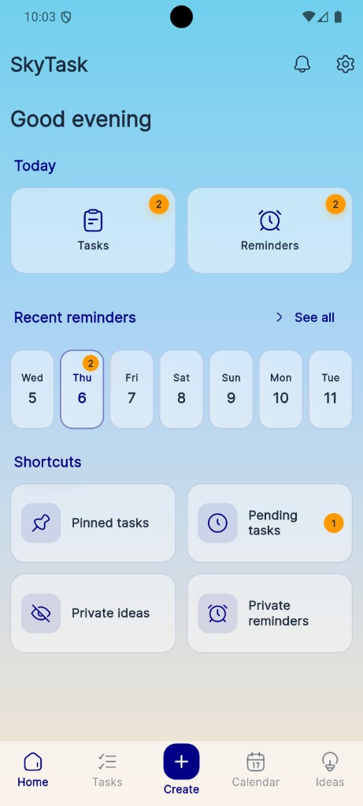
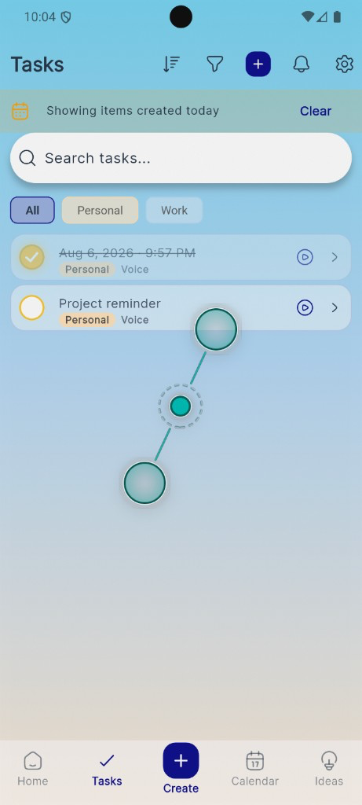
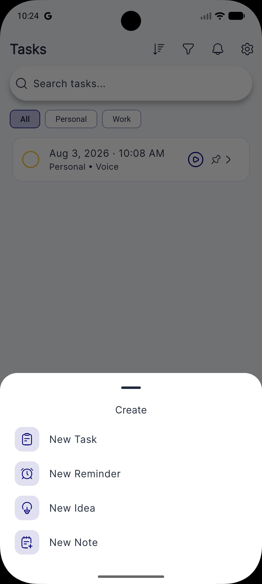
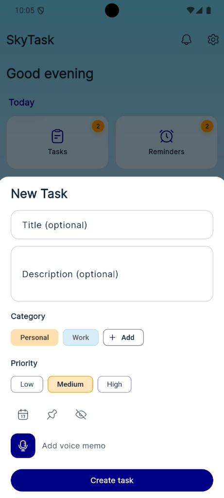
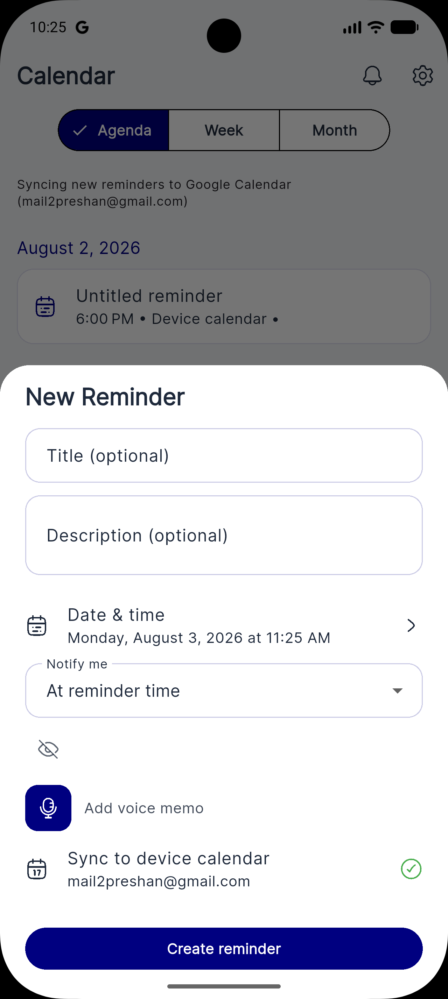
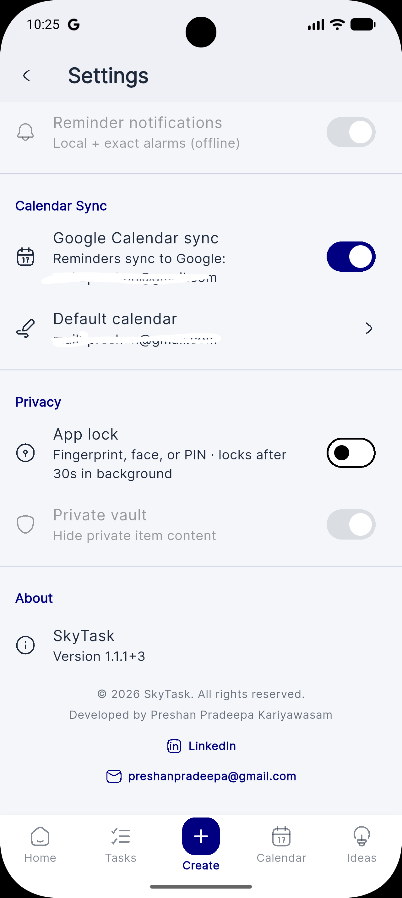

# SkyTask

Android app for tasks, reminders, ideas, and notes — with a local reminder engine, device calendar sync, voice memos, and optional PIN / biometric lock.

Built with Flutter by **Preshan Pradeepa Kariyawasam**.

## Screenshots

| Home | Tasks | Create |
|:----:|:-----:|:------:|
|  |  |  |

| New Task | New Reminder | Settings |
|:--------:|:------------:|:--------:|
|  |  |  |

Latest release: [v1.2.1](https://github.com/preshan/SkyTask/releases/tag/v1.2.1)

## Features

- Tasks with categories, priority, pin, archive, and search
- Reminders that keep working offline (local notifications + AlarmManager)
- Ideas and notes, including voice memos
- Device calendar integration (optional; skipped for private items)
- App lock with PIN or biometrics; private text encrypted at rest
- Dark / light theme with a day–night sky background
- Android home-screen shortcuts: long-press the app icon → New Task / Reminder / Idea

## Stack

| Area | Choice |
|------|--------|
| UI | Flutter, Material 3, Riverpod, go_router |
| Local DB | Isar |
| Notifications | flutter_local_notifications, AlarmManager, WorkManager |
| Calendar | device_calendar |
| Auth / cloud | Firebase Auth + Firestore (sync still in progress) |
| Security | local_auth, flutter_secure_storage, AES for private fields |
| Voice | record, audioplayers |
| Icons | hugeicons |

## Project layout

```
lib/
├── main.dart / app.dart
├── core/          # theme, router, services, DB, constants
├── features/      # home, tasks, reminders, ideas, notes, calendar, privacy, …
└── shared/        # reusable widgets (icons, voice, gates, surfaces)
```

Each feature follows `data/` → `domain/` → `presentation/`.

## How reminders work

Reminders are stored locally first, then scheduled on the device. They are not Firebase-only.

1. Save to Isar
2. Schedule a local notification
3. Schedule an AlarmManager alarm
4. Optionally create a device calendar event
5. Keep `notificationId` / `calendarEventId` on the reminder

They should still fire after the app is closed or the phone reboots (boot receiver + WorkManager).

## Colors

| Role | Light | Dark |
|------|-------|------|
| Brand | `#000080` | `#6EC6FF` |
| Accent | `#F59E0B` | `#FBBF24` |
| Gold (completed) | `#D4AF37` | — |

## Setup

Needs Flutter ≥ 3.2 and Android Studio. Firebase is required only if you want auth/sync.

```bash
flutter pub get
dart run build_runner build --delete-conflicting-outputs

# Optional: Firebase
dart pub global activate flutterfire_cli
flutterfire configure
# Place google-services.json in android/app/

flutter run
```

```bash
flutter test
flutter analyze
```

## Releases

- [CHANGELOG.md](CHANGELOG.md)
- [Release notes](docs/release/RELEASE_NOTES.md)
- [GitHub Releases](https://github.com/preshan/SkyTask/releases)

## Roadmap

Still planned: Google Calendar API sync, Drive backup, home-screen widgets, richer voice / assistant features. Firestore sync and polish are ongoing.
