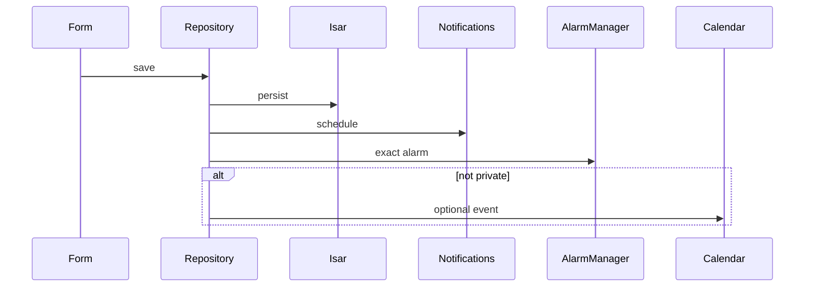

# SkyTask release notes

APKs are debug-signed for sideload testing (not Play Store builds). Older notes are kept below for history.

---

## 1.8.1 — 2026-08-06 · `1.8.1+17`

[Download SkyTask-1.8.1.apk](https://github.com/preshan/SkyTask/releases/download/v1.8.1/SkyTask-1.8.1.apk)

### Changes
- Category filter chips on Ideas, Notes, and Calendar (same style as Tasks)

---

## 1.8.0 — 2026-08-05 · `1.8.0+16`

[Download SkyTask-1.8.0.apk](https://github.com/preshan/SkyTask/releases/download/v1.8.0/SkyTask-1.8.0.apk)

### Changes
- Create menu redesigned as a 2×2 icon grid (Task / Reminder / Idea / Note)
- Calendar filters: smaller pills, “Reminder types” label, and a separator before view tabs

---

## 1.7.2 — 2026-08-05 · `1.7.2+15`

[Download SkyTask-1.7.2.apk](https://github.com/preshan/SkyTask/releases/download/v1.7.2/SkyTask-1.7.2.apk)

### Changes
- Compact "+" on Tasks, Calendar, and Ideas & Notes AppBars for quick create
- Smaller calendar SkyTask/All and Agenda/Week/Month chip filters

---

## 1.7.1 — 2026-08-05 · `1.7.1+14`

[Download SkyTask-1.7.1.apk](https://github.com/preshan/SkyTask/releases/download/v1.7.1/SkyTask-1.7.1.apk)

### Changes
- Cleaner list rows: no decorative type icons; chevron and private lock vertically centered

---

## 1.7.0 — 2026-08-05 · `1.7.0+13`

[Download SkyTask-1.7.0.apk](https://github.com/preshan/SkyTask/releases/download/v1.7.0/SkyTask-1.7.0.apk)

### Changes
- Soft pastel colors on categories; long-press to edit or delete (items move to another category first)
- Colored category labels on list rows
- Denser task / idea / note / calendar lists so more items fit on screen

---

## 1.6.0 — 2026-08-05 · `1.6.0+12`

[Download SkyTask-1.6.0.apk](https://github.com/preshan/SkyTask/releases/download/v1.6.0/SkyTask-1.6.0.apk)

### Changes
- Categories on reminders, ideas, and notes (same list as tasks: Work, Personal, customs)
- Calendar sync enable is more reliable (read + write permission; local SkyTask calendar fallback)

---

## 1.5.0 — 2026-08-05 · `1.5.0+11`

[Download SkyTask-1.5.0.apk](https://github.com/preshan/SkyTask/releases/download/v1.5.0/SkyTask-1.5.0.apk)

### Changes
- Calendar tabs: SkyTask reminders, or all calendars on the phone
- Sync can create a local SkyTask calendar when none are writable yet
- About credits link to GitHub (repo + developer)

---

## 1.4.1 — 2026-08-04 · `1.4.1+10`

[Download SkyTask-1.4.1.apk](https://github.com/preshan/SkyTask/releases/download/v1.4.1/SkyTask-1.4.1.apk)

### Changes
- Pick a backup folder (Download / Documents) before exporting
- Turn on fingerprint unlock after you already have a PIN
- Fixes red-screen crashes in password, PIN, and new-category dialogs
- Safer app lock overlay; backup save no longer fights the password dialog
- Google Drive backup removed for now (use Share / save instead)

---

## 1.4.0 — 2026-08-04 · `1.4.0+9`

[Download SkyTask-1.4.0.apk](https://github.com/preshan/SkyTask/releases/download/v1.4.0/SkyTask-1.4.0.apk)

### Changes
- Export a full backup from Settings → Data (compressed; optional password)
- Import from Files or shared storage
- Share / save the backup file after export (Drive, Files, email, etc. via the system share sheet)
- Private text travels with the backup; your app PIN stays on the device

---

## 1.3.1 — 2026-08-04 · `1.3.1+8`

[Download SkyTask-1.3.1.apk](https://github.com/preshan/SkyTask/releases/download/v1.3.1/SkyTask-1.3.1.apk)

### Fixes
- Enabling calendar sync now asks for calendar permission correctly and shows the real reason if it fails (permission vs no calendars), instead of always saying to add a Google account

---

## 1.3.0 — 2026-08-04 · `1.3.0+7`

[Download SkyTask-1.3.0.apk](https://github.com/preshan/SkyTask/releases/download/v1.3.0/SkyTask-1.3.0.apk)

### Changes
- Long-press the SkyTask icon for New Task / Reminder / Idea
- PIN create → confirm flow works reliably; backspace icon corrected
- App lock switch updates correctly; turning it off asks for PIN / biometrics
- Overdue reminders are re-armed after reboot
- Stronger PIN hashing (salted PBKDF2)

---

## 1.2.0 — 2026-08-03 · `1.2.0+6`

[Download SkyTask-1.2.0.apk](https://github.com/preshan/SkyTask/releases/download/v1.2.0/SkyTask-1.2.0.apk)

### Changes
- Day / night sky background and frosted surfaces on home and navigation
- Today: tasks and reminders due today; Recent reminders for the next 7 days
- Home shortcut badges with live counts
- About screen uses the app icon and centered credits
- Dark mode: PIN setup, lock screen, and onboarding are easier to read

### Screenshots

| Home | Tasks | Create |
|:----:|:-----:|:------:|
|  |  |  |

| New Task | New Reminder | Settings |
|:--------:|:------------:|:--------:|
|  |  |  |

---

## 1.1.3 — 2026-08-03 · `1.1.3+5`

[Download SkyTask-1.1.3.apk](https://github.com/preshan/SkyTask/releases/download/v1.1.3/SkyTask-1.1.3.apk)

### Fixes
- Crash when creating a reminder in release builds (ProGuard / Gson keep rules for local notifications)

### Note
Voice reminders are not written to the device calendar (same as private reminders). That is by design, not related to the crash above.

---

## 1.1.2 — 2026-08-03 · `1.1.2+4`

[Download SkyTask-1.1.2.apk](https://github.com/preshan/SkyTask/releases/download/v1.1.2/SkyTask-1.1.2.apk)

### Changes
- Home shortcuts: pinned / pending / private ideas / private reminders
- Today tiles and week reminder counts
- Amber accent; Hugeicons across the app
- About credits; calendar segment contrast; quieter voice-form autofocus

---

## 1.1.1 — 2026-08-03

[Download SkyTask-1.1.1.apk](https://github.com/preshan/SkyTask/releases/download/v1.1.1/SkyTask-1.1.1.apk)

### Changes
- Custom task categories
- About shows live app version and developer contact links
- Dark theme uses a lighter brand blue for readability

---

## 1.1.0 — 2026-08-02 · `1.1.0+2`

[Download SkyTask-1.1.0.apk](https://github.com/preshan/SkyTask/releases/download/v1.1.0/SkyTask-1.1.0.apk) (~66 MB)

First public feature cut with inline Create, voice memos, navy branding, and encrypted private text.

### Highlights
- Create from the bottom bar (task, reminder, idea, note)
- Voice memos with playback on lists
- Private text encrypted with AES-256; key in secure storage
- Navy brand and Hugeicons

### Reminder pipeline

### Limitations
| Area | Detail |
|------|--------|
| Voice | Private `.m4a` files are not encrypted on disk |
| Notes | Attachment paths are not encrypted when private |

### Upgrade
Install over the previous build as usual. Private items encrypt on the next save through the mappers. Microphone permission is needed for voice memos.
