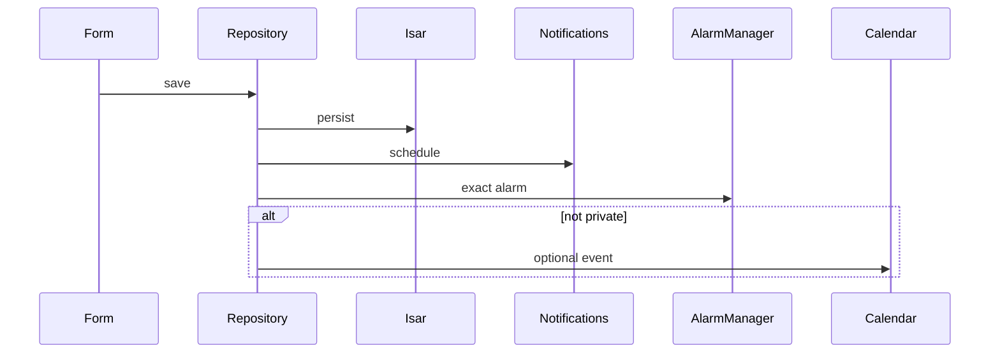

# SkyTask release notes

APKs are debug-signed for sideload testing (not Play Store builds). Older notes are kept below for history.

---

## 1.2.0 — 2026-08-03 · `1.2.0+6`

[Download SkyTask-1.2.0.apk](https://github.com/preshan/SkyTask/releases/download/v1.2.0/SkyTask-1.2.0.apk)

### Changes
- Day / night sky background and frosted surfaces on home and navigation
- Today: tasks and reminders due today; Recent reminders for the next 7 days
- Home shortcut badges with live counts
- About screen uses the app icon and centered credits
- Dark mode: PIN setup, lock screen, and onboarding are easier to read

### Screenshots

| Home | Tasks | Create |
|:----:|:-----:|:------:|
|  |  |  |

| New Task | New Reminder | Settings |
|:--------:|:------------:|:--------:|
|  |  |  |

---

## 1.1.3 — 2026-08-03 · `1.1.3+5`

[Download SkyTask-1.1.3.apk](https://github.com/preshan/SkyTask/releases/download/v1.1.3/SkyTask-1.1.3.apk)

### Fixes
- Crash when creating a reminder in release builds (ProGuard / Gson keep rules for local notifications)

### Note
Voice reminders are not written to the device calendar (same as private reminders). That is by design, not related to the crash above.

---

## 1.1.2 — 2026-08-03 · `1.1.2+4`

[Download SkyTask-1.1.2.apk](https://github.com/preshan/SkyTask/releases/download/v1.1.2/SkyTask-1.1.2.apk)

### Changes
- Home shortcuts: pinned / pending / private ideas / private reminders
- Today tiles and week reminder counts
- Amber accent; Hugeicons across the app
- About credits; calendar segment contrast; quieter voice-form autofocus

---

## 1.1.1 — 2026-08-03

[Download SkyTask-1.1.1.apk](https://github.com/preshan/SkyTask/releases/download/v1.1.1/SkyTask-1.1.1.apk)

### Changes
- Custom task categories
- About shows live app version and developer contact links
- Dark theme uses a lighter brand blue for readability

---

## 1.1.0 — 2026-08-02 · `1.1.0+2`

[Download SkyTask-1.1.0.apk](https://github.com/preshan/SkyTask/releases/download/v1.1.0/SkyTask-1.1.0.apk) (~66 MB)

First public feature cut with inline Create, voice memos, navy branding, and encrypted private text.

### Highlights
- Create from the bottom bar (task, reminder, idea, note)
- Voice memos with playback on lists
- Private text encrypted with AES-256; key in secure storage
- Navy brand and Hugeicons

### Reminder pipeline

### Limitations
| Area | Detail |
|------|--------|
| Voice | Private `.m4a` files are not encrypted on disk |
| Notes | Attachment paths are not encrypted when private |

### Upgrade
Install over the previous build as usual. Private items encrypt on the next save through the mappers. Microphone permission is needed for voice memos.
