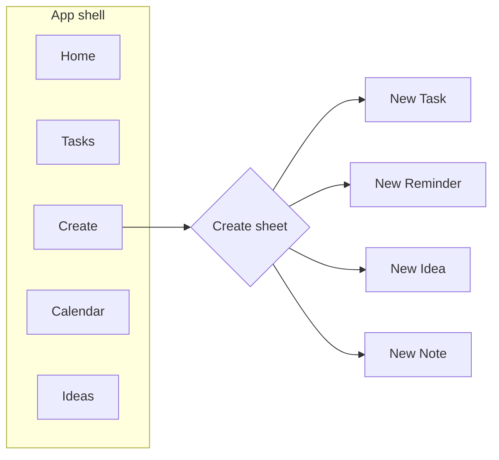
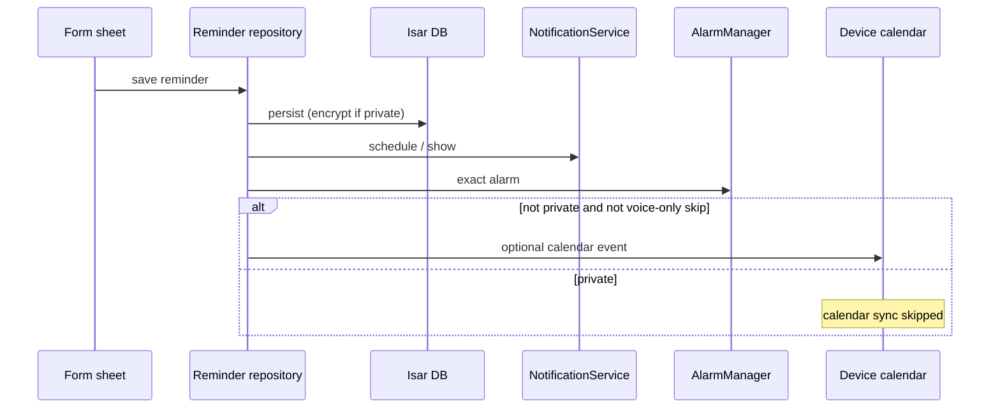
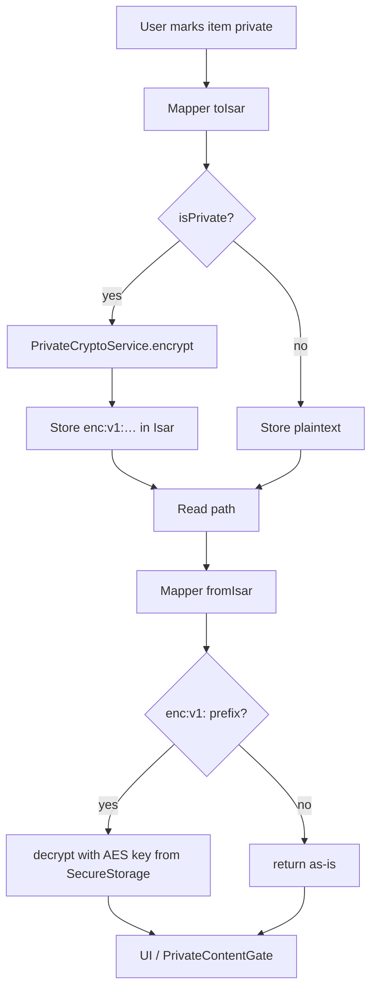
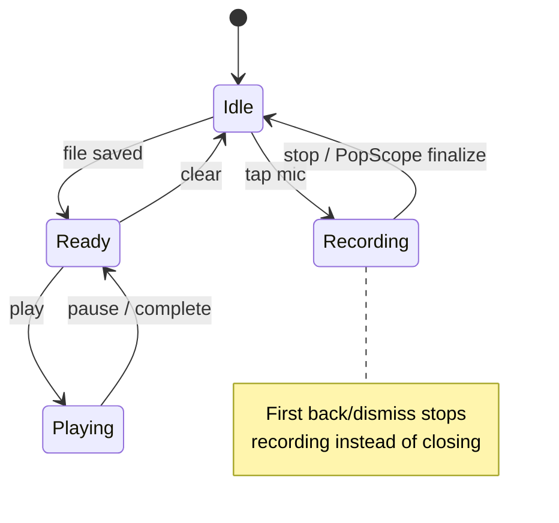

# SkyTask 1.1.3 — Release Notes

**Released:** 2026-08-03 · **Version:** `1.1.3+5`

Hotfix for release builds crashing when scheduling reminders (voice or text).

## Download

- **[SkyTask-1.1.3.apk](https://github.com/preshan/SkyTask/releases/download/v1.1.3/SkyTask-1.1.3.apk)** (Android, debug-signed for sideload)

## What's fixed

- **Reminders / notifications:** R8 was stripping Gson `TypeToken` generics used by `flutter_local_notifications`, causing `IllegalStateException` when creating a reminder (including voice). Added ProGuard keep rules + Gson 2.11.

## Note on voice + calendar

Voice reminders are **intentionally not synced** to Google/device calendar (same as private reminders). That is separate from this crash.

---

# SkyTask 1.1.2 — Release Notes

**Released:** 2026-08-03 · **Version:** `1.1.2+4`

Home shortcuts, amber accents, and a full Hugeicons pass across the app.

## Download

- **[SkyTask-1.1.2.apk](https://github.com/preshan/SkyTask/releases/download/v1.1.2/SkyTask-1.1.2.apk)** (Android, debug-signed for sideload)

## What's new

- **Home shortcuts:** pinned tasks, pending tasks, private ideas, private reminders
- **Today tiles:** Tasks / Ideas / Notes with amber count badges (created today)
- **This week:** Mon–Sun reminder count boxes that open that day’s agenda
- **Amber secondary** brand accent for badges and highlights
- **Hugeicons everywhere:** Material icons replaced with `SkyIcon` / Hugeicons
- **About:** centered credits with LinkedIn and mail icons
- **Voice UX:** skip description autofocus when you mostly save with voice
- **Calendar:** clearer selected Agenda / Week / Month contrast

## Screenshots

| Home | Tasks | Create |
|:----:|:-----:|:------:|
|  |  |  |

| New Task | New Reminder | Settings |
|:--------:|:------------:|:--------:|
|  |  |  |

---

# SkyTask 1.1.0 — Release Notes

**Released:** 2026-08-02 · **Version:** `1.1.0+2`

SkyTask 1.1 focuses on faster capture (inline Create + voice memos), a navy brand refresh, and encrypting private text at rest.

## Download

- **[SkyTask-1.1.0.apk](https://github.com/preshan/SkyTask/releases/download/v1.1.0/SkyTask-1.1.0.apk)** (Android, ~66 MB)
- Signed with the debug keystore for sideload testing (not Play Store distribution)

## Highlights

- **Inline Create** in the bottom bar — no floating FAB
- **Voice memos** on every item type, with play controls on lists
- **Private text encryption** (AES-256-CBC) with secure key storage
- **Navy brand** (`#000080`) and Hugeicons throughout

## Screenshots

| Home | Tasks | Create |
|:----:|:-----:|:------:|
|  |  |  |

> Captured on Android emulator. See also the [1.1.2 screenshots](#screenshots) above for newer UI.

## Architecture diagrams

### Navigation shell

### Reminder pipeline

### Private content encryption

### Voice memo lifecycle

## What’s new (detail)

### Capture & navigation
- Bottom nav: Home · Tasks · **Create** · Calendar · Ideas
- Create opens a sheet for Task / Reminder / Idea / Note
- Forms: description autofocus, category/priority chips, private eye-toggle, voice row

### Voice
- AAC `.m4a` memos via `record` + `audioplayers`
- Empty titles become `MMM d, yyyy · h:mm a`
- Play buttons on home, calendar, and ideas lists

### Privacy & security
- `PrivateCryptoService`: AES-256-CBC, key in `FlutterSecureStorage`
- Encrypted fields: titles, descriptions/content, tags (when private)
- Notifications for private reminders never show the real title
- Calendar sync skipped for private items; agenda tiles gated

### Brand
- Primary `#000080`, secondary `#191970`, background `#F4F6F9`

## Known limitations

| Area | Limitation |
|------|------------|
| Voice | Private voice files remain plaintext on disk |
| Notes | Attachment path strings are not encrypted when private |
| Android 16 KB | Emulator may warn about native lib alignment (Isar/Flutter) |

## Upgrade notes

1. Update to `1.1.0+2` and run a normal install/upgrade.
2. Existing private items are encrypted on the next write through mappers.
3. Grant microphone permission to use voice memos.

## Code review (pre-release)

Bugbot reviewed uncommitted changes before this release. Findings addressed in-tree:

| Severity | Finding | Action |
|----------|---------|--------|
| High | Cleartext private voice on disk | Documented limitation (v1.2 candidate) |
| High | Recording lost on sheet dismiss | `PopScope` + safe teardown |
| Medium | Voice title rewritten on edit | Use `createdAt` when regenerating |
| Low | Settings back always → home | Prefer `context.pop()` |

Remaining medium items (duplicate past-due notification paths; note attachments) tracked for follow-up.
